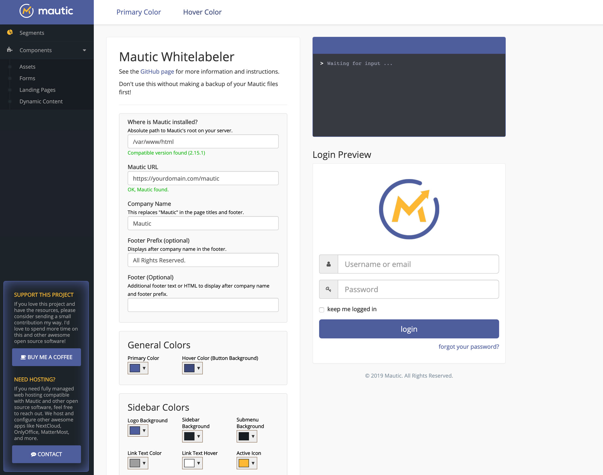
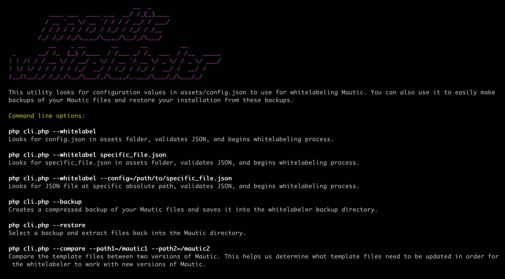

# Mautic Whitelabeler 2.0

Mautic Whitelabeler makes customizing the core branding elements of [Mautic](http://github.com/mautic/mautic) a simple, automated process.



**Easily customize:**

* Logo at the top of the left sidebar and its background color
* Colors used in the sidebar, its links, and the active icon
* General colors (links, buttons, hover, panel headings)
* Logo on the login screen
* Company name in page titles, login, and footer
* Add other HTML or text content in the footer
* Favicon

## New in Mautic Whitelabeler 2.0  :tada:

* Customize the entire sidebar
* Command line whitelabler
* Save your whitelabeling configuration as a JSON file. Images are saved in the assets folder for future whitelabeling
* Whitelabel, backup, and restore Mautic from the command line
* Customize and add additional content in the footer
* Improved error reporting

## Requirements

* Mautic versions 2.15.0 - 5.0.3 (Use previous [Whitelabeler 1.0](https://github.com/nickian/mautic-whitelabeler/releases) release for older versions of Mautic. Beta versions are not tested.)
* Make sure you have installed Mautic using the correct zip file from the [Mautic releases page](https://github.com/mautic/mautic/releases). DO NOT use the "update" zip file. The whitelabeler will not work correctly with these versions.

* Apache server (will work on some nginx configurations, but not officially supported)
* The PHP cURL extension must be installed and enabled
* The PHP GD library must be installed and enabled
* `allow_url_fopen` php.ini directive set to true (file_get_contents function)
* Make sure `post_max_size` and `upload_max_filesize` in `php.ini` are set to high enough values depending on the size of the images you're uploading

## Installing and Using the Whitelabeler

1. BACKUP YOUR FILES first in case something goes wrong. This app overwrites some of Mautic's core files.

2. Move the `mautic-whitelabeler` directory and its contents into the root directory of your Mautic installation. There are a couple ways to do this:

    * Download a release and copy the `mautic-whitelabeler` directory into the root directory of your Mautic installation.

    * Use git to clone this repository into the root directory of your Mautic installation.

    * When you are finished, there should be a new `mautic-whitelabeler` directory located inside your Mautic root installation directory. For instance, if your mautic root directory is `/var/www/html`, the `mautic-whitelabeler` folder should be located at `/var/www/html/mautic-whitelabeler`.

3. Navigate to `https://yourmauticinstancedomain.com/mautic-whitelabeler`.

4. Specify the "Company Name," which will replace "Mautic" in the page titles and footer.

5. Specify your color hex codes.

6. Specify sidebar and login logo files (preferably transparent PNG files) and their widths and margins.
	* Avoid uploading large images (i.e., over 1500px might be too large depending on your setup). The `imagecreatefrompng` function can exceed PHP's memory limit and fail while trying to process and resize large images.

7. Specify a favicon, either .ico or .png. If you don't specify a file, a favicon will be generated from your login logo file.

8. (Optional) Hit the "save" or "save as" button to write your configuration settings to a JSON file in the `assets` folder. If a config.json file is found upon loading the whitelabeler, your settings will be loaded automatically. You can also load a specific JSON file from the assets folder using the "Load a Config File" button. Having a config.json will also allow you to whitelabel from the command line.

    *(**Note:** Using the "Save" button after you've loaded a JSON file other than `config.json` will write to the generic `config.json` file. "Save" always writes to `assets/config.json`. If you want to update your already saved, separate JSON file, you'll have to use "Save As" and simply give it the name it's already using to overwrite the current file)*

9. Hit the whitelabel button and wait for the status terminal to run through the steps. Make sure to clear your browser's cache before pulling up your Mautic instance to see the results!

10. When you're finished, open the `.htaccess` file and uncomment the `deny from all` line. This prevents the directory from being publicly accessible. Either that, or remove or move the whitelabler directory.

## Using the Command Line Whitelabeler

The `cli.php` file is a command line utility that allows you to whitelabel from the command line. It also allows you to create backups of your Mautic files and restore your installation from those files.

### Example usage

In these examples, we are running the script as the Apache web server user "www-data" in order to keep file permissions intact and make sure the web server user retains access to the Mautic files that are modified.

This will display the command line menu:

```
sudo -u www-data php cli.php
```


#### Whitelabel

```
sudo -u www-data php cli.php --whitelabel
```

This will run the whitelabeling process from the command line using the values stored in config.json. First, you'll have to create the config.json file by using the "save" button in the web interface.

```
sudo -u www-data php cli.php --whitelabel specific_file.json
```

This will allow you to whitelabel using a specific file located in the `assets` folder.

```
sudo -u www-data php cli.php --whitelabel --config=/path/to/specific_file.json
```

This will allow you to whitelabel using a JSON file located somewhere other than the `assets` folder.

#### Backup

```
sudo -u www-data php cli.php --backup
```

Create a backup of your current Mautic files before running the whitelabeler. This will create a .tgz file in the whitelabeler's `backup` directory with your version and a timestamp. For example: `2.15.1_backup_2019-04-10_20-30-00.tgz`.


#### Restoring from a Backup

```
sudo -u www-data php cli.php --restore
```

If you have any backups in the backups directory, you will be prompted to select a backup to restore from. I recommend doing a manual backup before trying this for the first time your system, just to be safe.


## Common Issues / Support  :sos:

#### Composer Install

Make sure you have done a `composer install` on your project before running the whitelabel. If you're having issues seeing the assets update, run `composer install` in the Mautic root directory and try again.

#### `.htaccess` Issue in 4.2.0+

Some changes were made to Mautic's root `.htaccess` file recently. If you put the whitelabeler in Mautic's root directory and try to access it, you may get a "forbidden" error as a result of the rules in this `.htaccess` file. You must either move the whitelabeler directory to another location where you can access, or simply raname the `.htaccess` file in the root temporarily, then change it back after whitelabeling.

#### Mautic installation not found at path

This means the script is not able to find the absolute path to the Mautic files on your server. This validation checks for a `version.txt` file in the `/app` folder. Make sure this file exists and is accessible by your web server.

Usually doing: `chown -R www-data:www-data /path/to/mautic` will fix the permissions issue with Apache.

#### Mautic installation not found at this URL

This means the script is not able to find your Mautic installation via its publicly accessible URL. This validation checks for the `favicon.ico` file in Mautic's root directory to confirm Mautic's root URL. Make sure the file exists and is accessible in your browser.

Make sure the cURL PHP extension is installed. Open the `phpinfo.php` file in this folder and search the page for `cURL support` to make sure its installed.

#### Support

Please read through the [previous Issues](https://github.com/nickian/mautic-whitelabeler/issues?utf8=%E2%9C%93&q=) before creating a new one.

If you would like support or are looking for managed hosting, we are happy to help. You can [book a consultation appointment here.](https://client.creative.link/appointly/appointments_public/form).

You can join the public chat channel on our Mattermost server here: [Mautic Chat](https://creatv.link/mautic-chat).

## Credits :thumbsup:

Mautic Whitelabeler makes use of a couple of other libraries:

* [Mautic](https://github.com/mautic/mautic)
* [PHP-ICO](https://github.com/chrisbliss18/php-ico) for favicon generation
* [Spectrum](https://github.com/bgrins/spectrum) for the color selector

## Advice / Disclaimer  :no_entry_sign:

This app is not offically supported or affiliated with Mautic.

While this tool is convenient, it is not intended for inexperienced users. You should be comfortable with the command line and at least somewhat familiar with PHP. Everyone's server environment is slightly different. This was designed to run optimally on Ubuntu 18.04 with Apache 2.4 and PHP 7.2.

Whitelabeling Mautic does NOT mean pretending Mautic is your company's own product and attempting to resell it. Do not trick your clients into thinking the Mautic platform is developed and maintained by you. Mautic is an open source, community project, like WordPress. You should Whitelabel the product with your client's brand, not your own! Always disclose that you're running Mautic for your clients, just like you would with WordPress.
