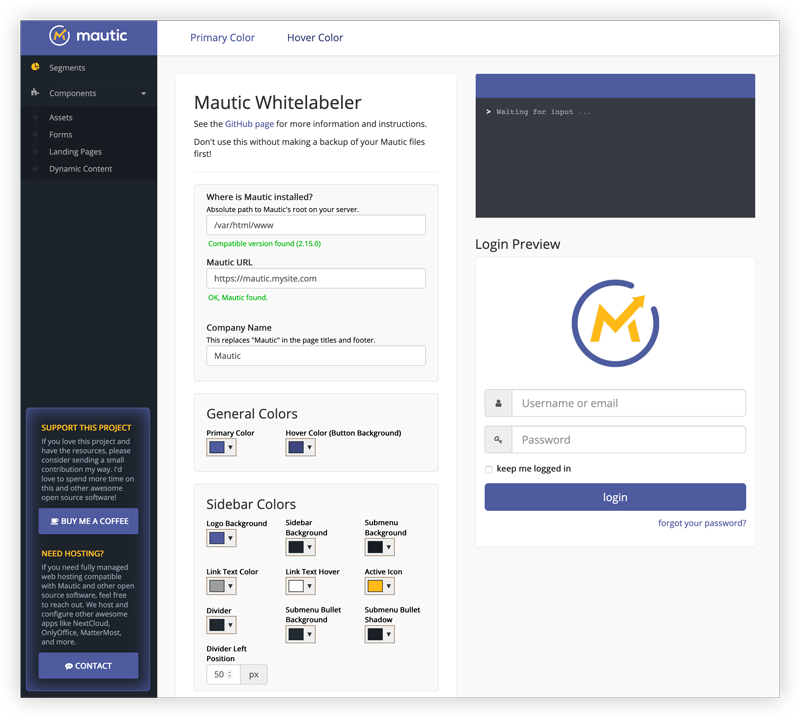

# Mautic Whitelabeler

Whitelabeling [Mautic](http://github.com/mautic/mautic) is a tedious process. Not to mention you also have to redo your work every time you update since your files are overwritten in the update process.

Mautic Whitelabeler makes customizing the core branding elements of Mautic a super simple, automated process. Just clone this directoy on your server and navigate to it in your browser.

**With this script, you can easily customize:**

* The main logo at the top of the sidebar and its background color.
* Logo on the login screen
* Company name in page titles, globally
* Colors (links, buttons, panel headings)
* Favicon
* Company name in the footer

##Requirements

* Mautic versions 2.5.0 - 2.7.1
* `allow_url_fopen` php.ini directive set to true (uses file_get_contents)
* GD Library
* Probably other dependencies I'm not aware of yet.

##Installation / Usage

1. It's probably smart to backup your files first. At least do it the first time you use this.
2. Clone this repository somewhere on your server that can access your Mautic installation (it's most convenient to clone it in the root of your Mautic directoy).
3. Specify the "Company Name," which will replace "Mautic" in the page titles and footer.
4. Specify your color hex codes.
	* **Logo Background:** This is the color behind the Mautic logo in the sidebar (top left corner).
	* **Primary Color:** This color will replace Mautic's primary purple in links, buttons and panel headers.
	* **Secondary Color:** This will define the link and button mouse hover state color.
5. Specify sidebar and login logos files (preferably transparent PNG files) and their widths and margins, which you can adjust with a live preview.
	* Avoid uploading large images (i.e., "large" in terms of dimensions ~ > 1500px might be too large). 
	* `imagecreatefrompng` function can exceed PHP's memory limit and fail while trying to process and resize large images.
6. Specify a favicon. If you don't have a .ico file, one will be created. If you don't specify a file, a favicon will be generated from your login logo file.
7. Make sure to REMOVE or MOVE this directory so it's not publicly accessible once you're done using it.